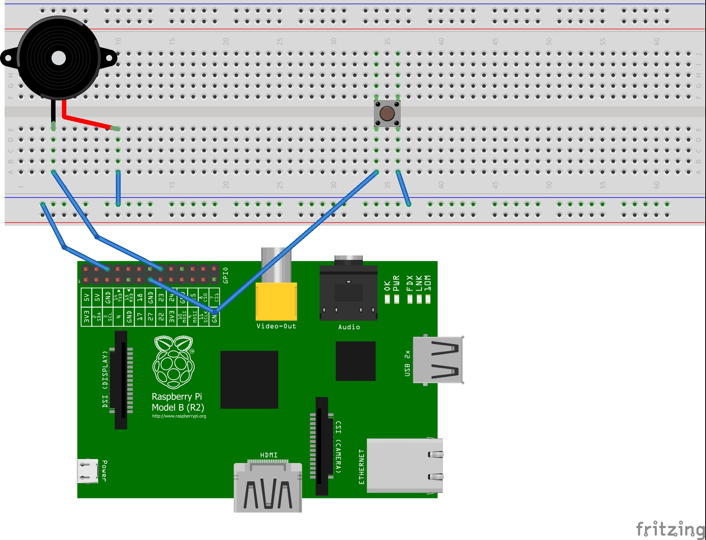
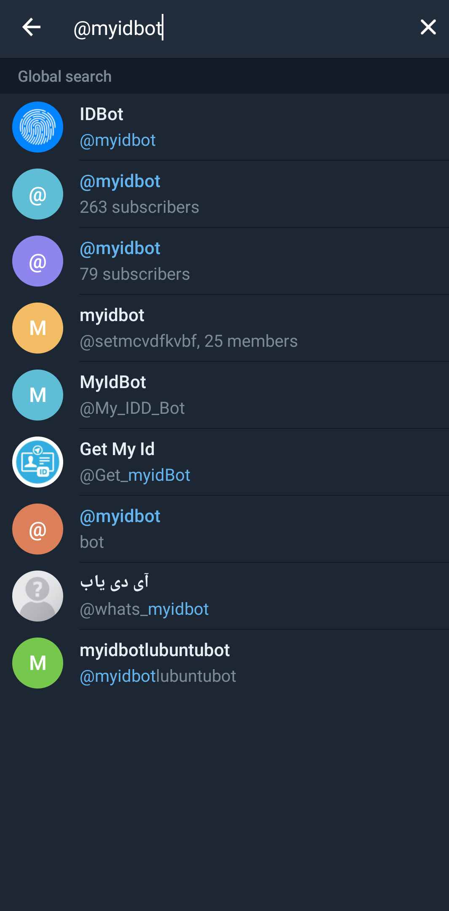
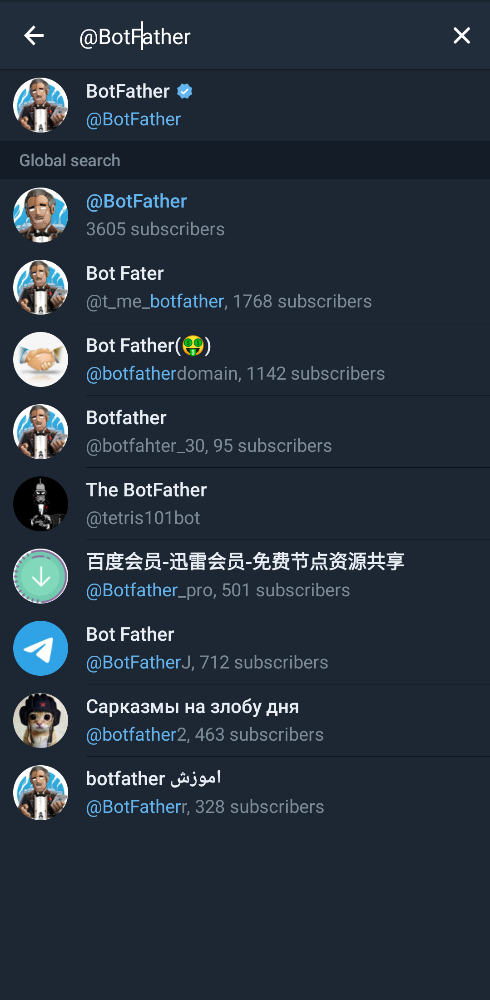
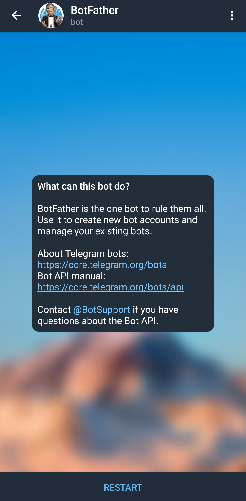
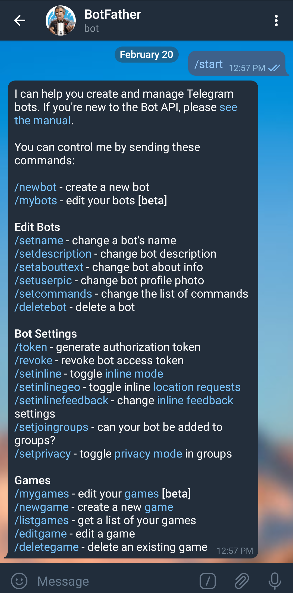
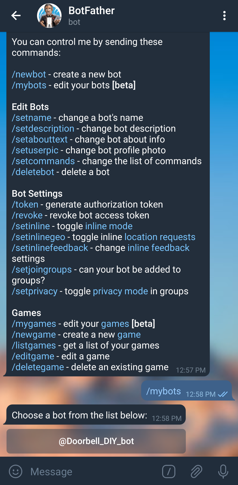
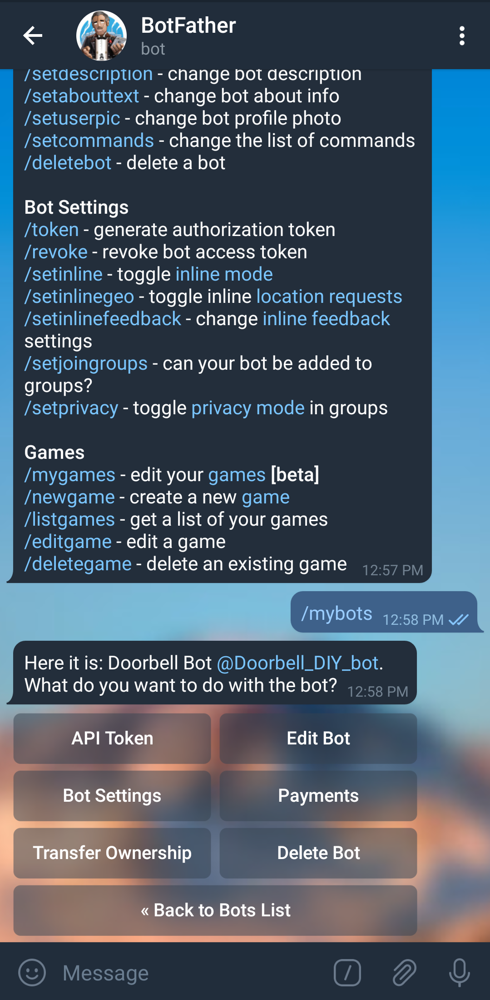
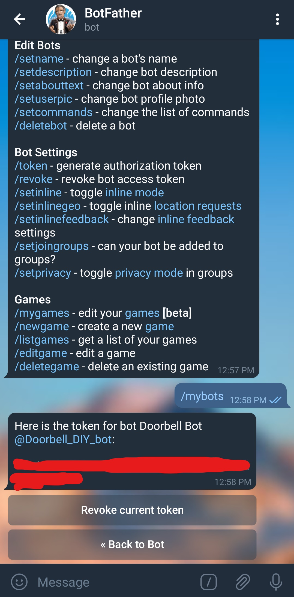

# Smart-Doorbell-Telegram
Smart Doorbell using Raspberry Pi 4B and Telegram Bot

# Tutorial for DIY
> **Medium** : [Raspberry Pi Doorbell with Telegram BOT — Part 1](https://lagnos.medium.com/raspberry-pi-doorbell-with-telegram-bot-part-1-fa75d747524d) 
 **Medium** : [Raspberry Pi Doorbell with Telegram BOT — Part 2](https://lagnos.medium.com/raspberry-pi-doorbell-with-telegram-bot-part-2-dbaf633feda6)

# Features Available
* Click picture and Send the image on Telegram using BOT
* Images are saved on Pi and directories are saved on basis of Date and Time

# Features to add
- [x] Get Image and Time data directly from Telegram Bot
- [ ] Integrate AI / OpenCV for face detection
- [ ] After AI integration migrate project from Telegram Bot to an Android app or Cross platform app for Video and Voice integrations to the doorbell

# Required Modules
Use python 3 latest version.
* fswebcam
> To use USB webcam for clicking pictures. Already isntalled in Raspberry Pi OS. If not present, follow the steps given here : **[https://www.raspberrypi.org/documentation/usage/webcams/](https://www.raspberrypi.org/documentation/usage/webcams/)**

* Telepot
> For telegram bot 
First install pip if not installed : **`sudo apt-get install python-pip`** 
**To install telepot** : **`sudo pip install telepot`**

* OS
> For saving images and sotring
* Time
> For sleep and date time functions
* Thread
> For multithreading
* RPi.GPIO
> For GPIO functions

# Circuit for the Doorbell

# Telepot Notes:
There are two variables : `chat_id` and `bot token` which you have to get and paste it in the python file import the import lines. You should first create your Bot using BotFather. You can look at any tutorial available on Google.

## To get Chat_id:
  

## To get Bot Token:
     

# License
 GNU GENERAL PUBLIC LICENSE
 Version 3, 29 June 2007
